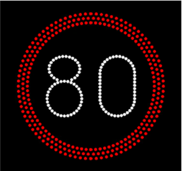
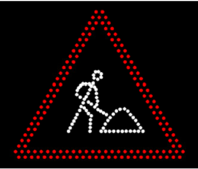
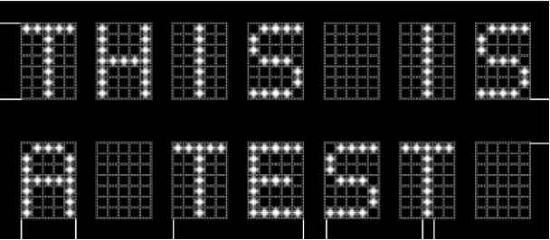

# Use-cases
This file lists real-world use-cases that we we want our VMS SXL to support.
For each use-case we list the displays (components) by type.

European requirements for VMS signs is defined with:
- EN 12966:2014+A1:2019 - Road vertical signs - Variable message traffic signs

## Tunnel warning sign
A combined  sign with warning lights, a large icon and some text. It's placed outside the tunnel and is used when the tunnel is closed.
- 1 icon (warning icon)
- 1 text (warning message, two lines)
- 1 lamp (set of blinking warning lights)

## Parking space sign
Shows free spaces left at different parking spots. Text is monochrome, but can sometimes change color depending on whether there are free spots, or not:
- 3 texts (showing only integers)

## Motorway control system
Typically above the lanes of the motorway.
For each lane a few things can be shown:
- speed limit (number inside a ring)
- lane closure (cross)
- directions to switch lane (arrow)

Some of these icons include yellow flashers in the corners. Either as part of the display or as separate lamps.
The flasher are control by logic in the VMS, e.g. if the speed limit is reduced, then the flashers are activated.
This would normally be enforced by the VMS, but it should be possible to override this. It should also be possible to read the status of the flashers and the displays.

If the logic and enforcement of rules is done in the central system, it's very important that you can change every display simultanously, and that nothing is changed if some display would not be able to shown what you request, since that might result in an invalid status of displays.

This type of use-case could be handled by having an icon display and a lamp (set of flashers) per lane.

## Speed limit sign

Looks essentially like a tradional static sign, but is variable. A circle with a number inside, and some text underneath.
- 1 icon (showing 50/60/70)
- 1 text (optional)
- 1 lamp (ring around the sign)

## Warning sign

Triangular warning sign
- Icon
- Optional text

## Text sign

Text information. Can be part of another sign or stand alone.

## Bicycle VMS
One large pixel display, which can shown different things.
- 1 bitmap (messages, icons, etc)

## School Sign
One large pixel display, which usually display a standard "school ahead" sign, but can also show speed limit.
- 1 bitmap (messages, icons, etc)

## Your Speed
A sign that shows your speed when you drive by, and flashes if the speed is too high.
- 1 text (your speed, typically two digits)
- 1 lamp (set of blinking warning lights)

## Bus stop information
- 2 text displays stacked vertically, one with larger text, the other with smaller text
Page 59:
https://www.vejdirektoratet.dk/sites/default/files/2023-07/Projektering%20af%20variable%20vejtavler%20og%20vognbanesignaler%20webtilgængelig.pdf
Some use-cases include hardware that is very limited, and sometimes on battery. In these cases, you might want a very simple interface to just monitor the health of the device, and have all logic in the device using custom logic and custom handling of the display.
Or you could opt for a more generel device that is more flexible, where you use the vms sxl functions to change content.
 - 2 texts

